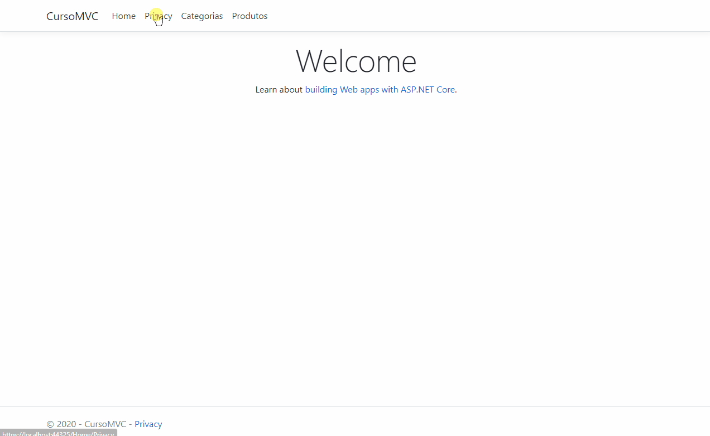

    
    

<h1 align="center">Desenvolvimento de aplicações com .NET</h1>

Aprenda a sobre o Entity Framework, como criar aplicativos web ASP .NET API e ASP .NET MVC. Você também vai criar testes na aplicação e um projeto com Unit Tests.

    

### :memo: Modulos

##### Conheça o Entity Framework e crie aplicações ASP.NET
 - [x] O que é Entity Framework
 - [x] Introdução ao ASP.NET MVC
    > MVC: padrão de arquitetura que divide a aplicação em três camadas: a visão(VIEW), o modelo(MODEL) e o controlador(CONTROLLER).
    Routes: as requisições são enviadas para uma ação da Controller. Ex: http://localhost:1234/{controller}/{action}/{id}
    Action Result: é o resultado de uma ação processada por uma controller e possui diversos tipos.
    HTTP Verbs: são métodos de protocolos HTTP que informão ao servidor qual ação ele deve executar. Ex: GET, POST, PUT, PATCH, DELETE.
    Razer: é uma view engine.
    Middlewares: são componentes que é executado em todas as solicitações na aplicação.
    Startup: Responsável pelo ponto inicial do projeto e configurações.
 - [x] Desenvolvimendo a aplicação
    > Usando o Visual Studio 2019 e configurando uma aplicação ASP.NET CORE 3.
    Foi preciso instalar o Dblocal para dar continuidade ao curso.
 - [x] Organizando a descrição
    > Alteração das ViewsData para mostrar o nome da categoria.
 - [x] Aplicando novas categorias no projeto
    > Alteração das informações nas views. Implementando Data Annotations

##### Criando e testado uma aplicação ASP.NET API e publicando na Cloud
 - [x] Aprendendo o conceito básico de API
    > O que é API: O que é REST? O que é Swagger?
 - [x] Criando um app web ASP .NET MVC - Passo 1
    > Criando uma API com Visual Studio. Instalação e configuração do Swagger. Vincular a Aplicação com a API. Criando o controller da Categoria e Produto.
 - [x] Criando um app web ASP .NET MVC - Passo 2
    > Não consegui implementar o Moq. Apresentou o sequinte erro:
    ~~~
    System.NotSupportedException : Unsupported expression: m => m.Categorias
    Non-overridable members (here: Context.get_Categorias) may not be used in setup / verification expressions.
    ~~~
 - [x] Publicando o projeto em nuvem
    > Não foi implementado o projeto na Azure.
### :computer: Tecnologias

 - C#
 - .NET Core 3.1
 - Entity Framework
 - Dblocal
 - Visual Studio